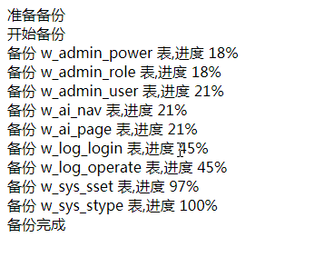

### 备份还原数据库
重构代码，文件名不再支持中文名，中文可能乱码或压缩文件失败  
数据库使用 PDO 连接，不再支持 MySql 连接  
备份文件名定义 `Backup`  类中 `$this->dir_file_name` 属性定义，默认使用 年月日时(2019081719)   
备份文件目录` Common` 类中 `$this->config['back_dir']`属性定义  
公共配置项 ` Common` 类中 `$this->config`
备份文件配置项 `Backup`  类中 `$this->back_config`  
还原文件配置项 `Import` 类中 `$this->import_config` 
 
**版本**  
测试PHP版本7.0.12，其他版本未测试; 建议PHP版本5.5以上

### 项目文件目录
    src
    |--- backup/        备份还原文件夹
    |--- Backup.php     备份数据库类文件
    |--- Common.php     备份、还原、修复表、优化表基类
    |--- Db.php         封装 sql 语句
    |--- DbData.php     数据库数据操作
    |--- demo.php       示例演示文件
    |--- Import.php     还原数据库类文件
    |--- OptimizeRepair.php 优化修复表类文件

### 配置项
    $config=[
           // 数据库配置
          'db'  =>  'web',           // 数据库名称        必传
          'host'=>  '127.0.0.1',     // 主机              必传
          'dbuser'=>'root',         // 数据库用户名称     必传
          'dbpw'=>  'root',         // 数据库密码         必传
          'charset' =>'utf8',       // 字符集
          'timezone'=>'PRC',        // 时区
          'prot'    => 3306,        // mysql 数据库端口号
          // 可以添加自定义配置项
          // 公共配置项
          'file_delimiter'          => '_',     // 分卷分割符,如果修改其他符号，文件名匹配正则需要修改
          'file_extension'          => "sql",  // 备份文件后缀名
          'compress_file_extension' => 'zip',// 压缩文件后缀
          'import_lock_file'        => 'import_lock_file.txt',// 导入锁文件名
          'backup_lock_file'        => 'backup_lock_file.txt',//备份锁文件
          'back_dir'                => './backup/',     // 备份文件路径，备份
          // 备份配置项
          'subsection'     => 5,             // 分卷大小，单位MB
          'min_subsection' => 2,       // 最小分卷数
          'max_subsection' => 50,       // 最大分卷数
          'compress'       => false,         // 是否压缩，默认不压缩
          'data_limit'     => 10,           // 表数据每10 条统计一次是否达到分卷字数，如果为0表数据中不判断
          'charset'        => 'utf8',      // 字符集
          // 还原配置项
          'del_file' =>false,	 // 还原完数据库是否删除文件夹以及文件夹中所有文件,默认不删除
          'read_size'=>8192       // 一次读取文件字节个数
    ];
    
### 备份数据库
默认分卷大小 5MB   
分卷计算默认是10 条数据统计一次分卷大小，如果设置为 0 ,表数据中不统计分卷大小，每卷可能会超出设置的分卷大小   
参数说明： 

    $config 数据库配置信息  
    $table 要备份的表名，备份整个数据库 null，备份指定前缀的数据表(参数是字符串)，备份指定表名的数据表(参数数组形式)  
    
 调用示例：  
 
    $exec_sql=new Backup($config);  
    $table=[];     
    $exec_sql->wirteFile($table);`

### 还原数据库
默认一次读取文件字节个数 8KB
 * 还原数据文件路径，还原文件名与路径相同
 * 例如还原文件路径是 ./backup/20190811015/
 * 配置文件所在路径 config['back_dir']='./backup/'，readFile('20190811015'),参数是需要还原的文件夹名称
 * 还原文件会自动查找下类文件：
 * ./backup/20190811015/20190811015_0.sql
 * ./backup/20190811015/20190811015_1.sql
 * ./backup/20190811015/20190811015.zip
 * 如果既有压缩文件也有sql文件,只会还原20190811015/20190811015_0.sql  20190811015/20190811015_1.sql
 * 压缩文件20190811015/20190811015.zip不会执行还原操作
 * 如果需要还原(导入)额外数据表，在./backup/20190811015/ 文件夹下放 20190811015_1.zip ,20190811015_2.zip压缩包即可，压缩包文件名一致，下标从1 开始；
 * 压缩包里面的文件与文件名一致，例如：20190811015_1.zip 压缩包文件有 20190811015_0.sql  20190811015_1.sql，下标从0 开始  
 
 参数说明：   
 
     $config 数据库配置项  
     $file_dir 还原文件夹名称
 
 调用示例：  
 
    $file_dir='2019081719'
    $import_sql=new Import($config);
    $import_sql->readFile('2019081719');

### 优化修复表
 参数说明：   
 
    $config 数据库配置项  
    $table  要操作的表名，操作整个数据库 null，操作指定前缀的数据表(参数是字符串)，操作指定表名的数据表(参数数组形式)  
 
 调用示例：  
 
    $optimize_repair=new OptimizeRepair($config);
    $table=[];
    $optimize_repair->optimize($table); // 优化表
    $optimize_repair->repair($table);  // 修复表

### 演示示例
